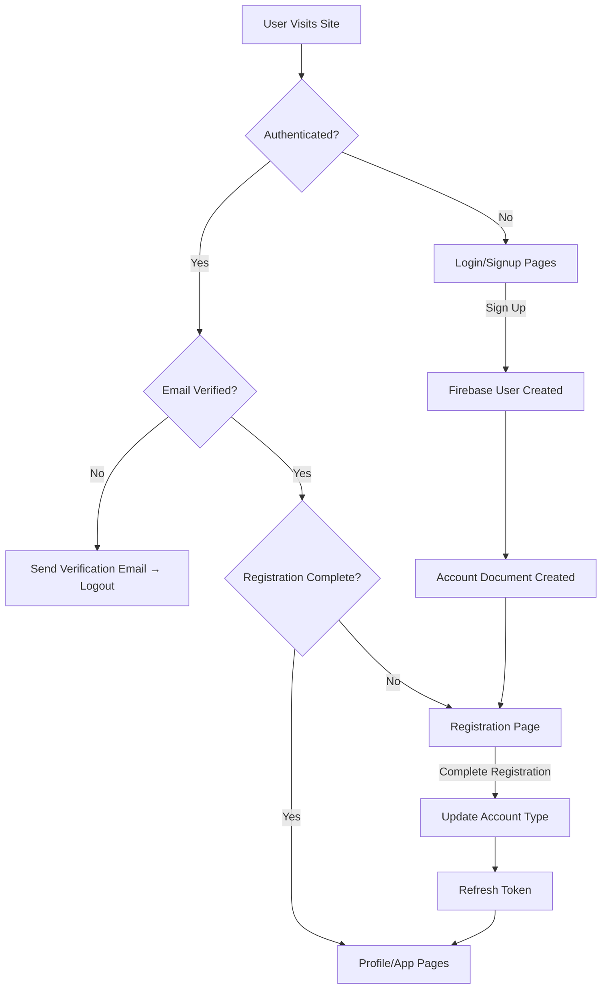

# Authentication and Registration Flow Documentation

## Overview

This document provides a comprehensive overview of the current authentication and registration flow in the ASCENDynamics NFP platform. The system follows a multi-step process that separates Firebase authentication from profile completion.

## Current Flow Architecture

### High-Level Flow

1. **Authentication** → User creates Firebase account
2. **Account Document Creation** → Firebase trigger creates Firestore document with `type: "new"`
3. **Registration** → User completes profile information and selects account type
4. **Profile Activation** → Account type is updated from "new" to "user" or "group"

---

## Detailed Flow Breakdown

### 1. Authentication Phase

#### Entry Points

- **Login Page** (`/auth/login`)
- **Signup Page** (`/auth/signup`)

#### Authentication Methods

1. **Email/Password Signup** (`signup.page.ts`)
2. **Email/Password Login** (`login.page.ts`)
3. **Google OAuth** (available on both pages)
4. **Email Sign-in Link** (passwordless login)

#### Signup Process (`/auth/signup`)

**Form Requirements:**

- Email (validated)
- Password (8+ chars, must include uppercase, lowercase, number, special character)
- Confirm Password (must match)
- Terms & Conditions agreement (required)

**Flow Steps:**

1. User fills out signup form
2. Form validation runs client-side
3. On submit: `AuthActions.signUp()` dispatched
4. **Auth Effects** (`auth.effects.ts`):

   ```typescript
   // Creates Firebase user account
   createUserWithEmailAndPassword(auth, email, password);

   // Gets ID token with claims
   const idTokenResult = await result.user.getIdTokenResult();

   // Creates AuthUser object
   this.createAuthUserFromClaims(user, claims);

   // Navigates to registration
   this.router.navigateByUrl(`/account/registration/${authUser.uid}`);
   ```

#### Login Process (`/auth/login`)

**Form Requirements:**

- Email (validated)
- Password (6+ chars minimum)

**Additional Options:**

- Email sign-in link (passwordless)
- Google OAuth
- Forgot password
- Navigate to signup

---

### 2. Account Document Creation (Firebase Function)

#### Firebase Function Trigger

**Location:** `functions/src/auth/user/triggers/onCreate/index.ts`

**Trigger:** `functions.auth.user().onCreate()`

**Function:** `createUserProfile`

**Process:**

1. Triggers automatically when Firebase user is created
2. Creates document in `accounts` collection with user's UID
3. Sets initial account data:
   ```typescript
   {
     id: user.uid,
     name: user.displayName || user.email?.split("@")[0],
     tagline: "New and looking to help!",
     iconImage: user.photoURL || "assets/image/logo/ASCENDynamics NFP-logos_transparent.png",
     heroImage: "assets/image/userhero.png",
     type: "new", // Key field - indicates incomplete registration
     contactInformation: {
       privacy: "private",
       emails: [{email: user.email}],
       phoneNumbers: [],
       addresses: [],
     },
     email: user.email,
     privacy: "public",
     totalHours: 0,
     legalAgreements: {
       termsOfService: { accepted: true, datetime: now, version: "1.0.0" },
       privacyPolicy: { accepted: true, datetime: now, version: "1.0.0" }
     },
     createdAt: now,
     createdBy: user.uid,
     lastLoginAt: now,
     lastModifiedAt: now,
     lastModifiedBy: user.uid
   }
   ```

---

### 3. Registration Phase

#### Route Protection

**Route:** `/account/registration/:accountId`

**Guard:** `RegistrationAuthGuard`

**Protection Logic:**

- Must be authenticated
- Can only access own registration page
- Redirects to profile if registration already completed
- Allows access even if email not verified (for registration completion)

#### Registration Page (`registration.page.ts`)

**Key Features:**

- Disables side menu during registration
- Shows account type selection cards
- Loads existing account data
- Checks registration status and redirects if already completed

**Account Type Selection:**

- **User Account**: Personal user profile
- **Group Account**: Organization/group profile

**UI Components:**

1. Account type selection cards (User vs Group)
2. Unified registration form (loads after type selection)

#### Unified Registration Component

**Location:** `unified-registration.component.ts`

**Purpose:** Single form component that handles both user and group registration

**Key Features:**

- Dynamic form based on account type
- Accordion-based sections:
  - Basic Information
  - Contact Information
  - Group Details (for groups only)
- Form validation
- File upload support
- Account update and navigation

**Form Sections:**

1. **Basic Information**

   - Name (changes label based on type: "Name" vs "Group Name")
   - Tagline (required)
   - Description

2. **Contact Information**

   - Emails (up to 5)
   - Phone Numbers (up to 5)
   - Addresses (up to 3)
   - Web Links (up to 10)

3. **Group Details** (Groups Only)
   - Group Type (Nonprofit, Community, Cooperative, etc.)
   - Google Calendar URL

**Submission Process:**

```typescript
onSubmit() {
  // Updates account with form data
  const baseAccount = {
    ...this.account,
    ...formValue,
    type: this.accountType, // Changes from "new" to "user" or "group"
  }

  // Dispatches update action
  this.store.dispatch(AccountActions.updateAccount({account: baseAccount}))

  // Forces token refresh to get updated claims
  this.store.dispatch(AuthActions.refreshToken({forceRefresh: true}))

  // Navigates to profile page
  this.router.navigateByUrl(`/account/${this.account.id}`)
}
```

---

### 4. Account Update and Claims Sync

#### Account Update Effect (`account.effects.ts`)

**Process:**

1. Updates Firestore document
2. Triggers `updateAccountSuccess` action
3. Syncs AuthUser with updated account data
4. Shows success toast

#### Firebase Function - Account Update Trigger

**Location:** `functions/src/database/accounts/triggers/onUpdate/index.ts`

**Purpose:** Updates Firebase custom claims when account changes

**Triggers On:**

- Account type change
- Name change
- Image changes
- Settings changes

**Claims Updated:**

```typescript
{
  type: after.type,
  displayName: after.name,
  heroImage: after.heroImage,
  iconImage: after.iconImage,
  tagline: after.tagline,
  settings: after.settings
}
```

#### Token Refresh Effect (`auth.effects.ts`)

**Purpose:** Refreshes ID token to get updated custom claims

**Process:**

1. Forces token refresh from Firebase
2. Gets updated claims
3. Updates AuthUser in store
4. Enables navigation to protected routes

---

## Navigation and Guards

### Authentication Guards

1. **SecureInnerPagesGuard**

   - Protects login/signup pages
   - Redirects authenticated users away from auth pages

2. **AuthGuard**

   - Protects authenticated routes
   - Checks email verification
   - Validates registration completion for specific routes

3. **RegistrationAuthGuard**

   - Protects registration routes
   - Ensures user can only access own registration
   - Redirects if registration already completed

4. **RegistrationCompletedGuard**
   - Protects profile routes
   - Redirects to registration if incomplete

### Navigation Flow



---

## State Management

### Auth State

- `AuthUser` object with Firebase user data + custom claims
- Managed through NgRx store
- Updated on authentication events and token refresh

### Account State

- `Account` objects stored in normalized entities
- Loaded on-demand from Firestore
- Synced with AuthUser when updated

### Key Selectors

- `selectAuthUser` - Current authenticated user
- `selectIsLoggedIn` - Authentication status
- `selectAccountById` - Account by ID

---

## Current Issues and Improvement Opportunities

### Issues Identified

1. **Complex Flow**: Multi-step process with potential failure points
2. **Race Conditions**: Token refresh and account loading timing issues
3. **UX Confusion**: Users may not understand why they're redirected to registration after signup
4. **Error Handling**: Limited error recovery mechanisms
5. **Navigation Complexity**: Multiple guards and redirection logic

### Potential Improvements

1. **Streamlined Onboarding**

   - Single-step registration during signup
   - Progressive disclosure of optional fields
   - Clear progress indicators

2. **Better Error Handling**

   - Retry mechanisms for failed operations
   - Clear error messages and recovery options
   - Offline support considerations

3. **Simplified Navigation**

   - Consolidate guard logic
   - Reduce number of redirections
   - Clearer routing structure

4. **Enhanced UX**

   - Loading states and progress indicators
   - Better mobile experience
   - Account type preview before selection

5. **Technical Improvements**
   - Reduce complexity in auth effects
   - Better type safety
   - Improved testing coverage

---

## File Structure Reference

### Frontend Files

```
src/app/
├── modules/auth/
│   ├── pages/
│   │   ├── login/login.page.ts
│   │   └── signup/signup.page.ts
│   └── auth-routing.module.ts
├── modules/account/
│   ├── pages/
│   │   └── registration/
│   │       ├── registration.page.ts
│   │       └── components/unified-registration/
├── core/
│   ├── guards/
│   │   ├── auth.guard.ts
│   │   ├── registration-auth.guard.ts
│   │   └── secure-inner-pages.guard.ts
│   └── services/
│       ├── auth.service.ts
│       └── auth-navigation.service.ts
└── state/
    ├── effects/
    │   ├── auth.effects.ts
    │   └── account.effects.ts
    └── reducers/
        ├── auth.reducer.ts
        └── account.reducer.ts
```

### Backend Files

```
functions/src/
├── auth/user/triggers/onCreate/index.ts
└── database/accounts/triggers/onUpdate/index.ts
```

---

## Recent Fixes

### Google Sign-In Registration Navigation Fix

**Issue**: Google sign-in users were not being properly redirected to the registration page for new accounts. Users experienced "no account found" errors and delays before navigation.

**Root Cause**:

1. The `createAuthUserFromClaims` method was filtering out accounts with `type: "new"` when waiting for account data to load
2. There was a race condition between Firebase Auth user creation and the Firebase function that creates the account document
3. The app tried to load the account immediately after authentication, but the Firebase function needed time to create the account document

**Fix**: Implemented a comprehensive solution:

1. **Modified account loading logic** to accept accounts with `type: "new"`
2. **Added retry mechanism** with exponential backoff for account loading
3. **Graceful fallback** - if account loading fails, create minimal AuthUser with `type: "new"`
4. **Improved error handling** - suppress "Account not found" toasts for new users

**Code Changes**:

**In `auth.effects.ts`**:

```typescript
// Added waitForAccountCreation method with retry logic
private waitForAccountCreation(userId: string): Observable<any> {
  // Exponential backoff retry mechanism
  // Falls back to minimal AuthUser if all retries fail
}

// Modified createAuthUserFromClaims to handle new users better
filter((updatedAccount) => updatedAccount !== undefined), // Accepts "new" type
```

**In `account.effects.ts`**:

```typescript
// Suppressed error toasts for "Account not found" (expected for new users)
if (!error.message.includes("Account not found")) {
  this.showToast(`Error loading account: ${error.message}`, "danger");
}
```

**Result**:

- New Google sign-in users navigate smoothly to registration
- No more "Account not found" error messages
- Faster navigation with proper retry handling
- Better user experience during the account creation race condition

---

## Conclusion

The current authentication and registration system is functional but complex. It successfully separates Firebase authentication from profile completion, allowing for flexible account types and comprehensive user data collection. However, there are opportunities to streamline the flow, improve error handling, and enhance the user experience.

The system's strength lies in its flexibility and comprehensive data model, while its main weakness is the complexity that can confuse users and create maintenance challenges.
