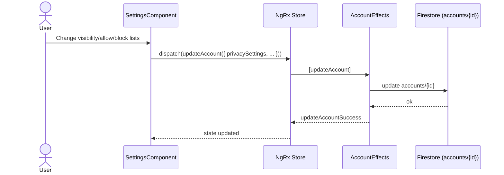
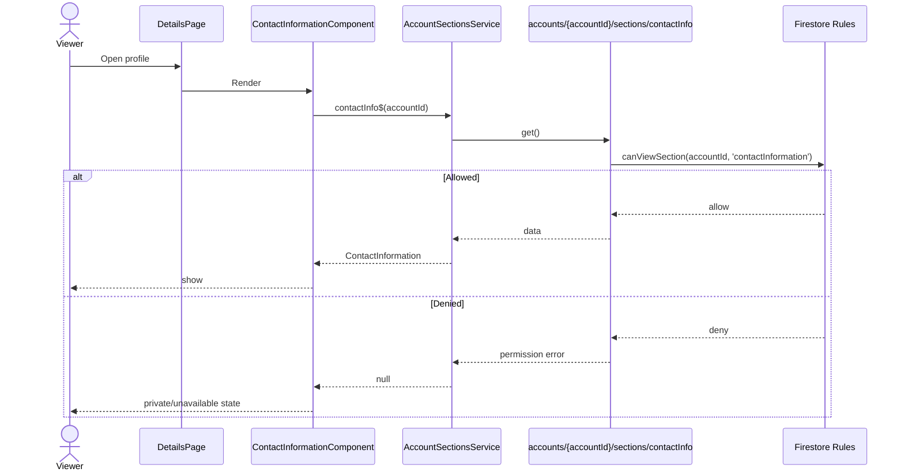
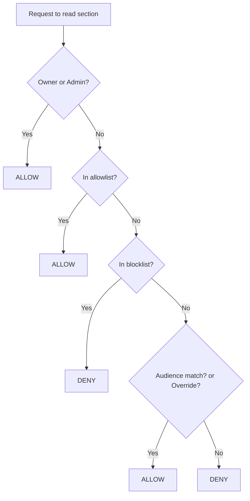
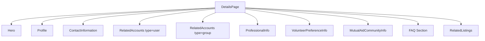
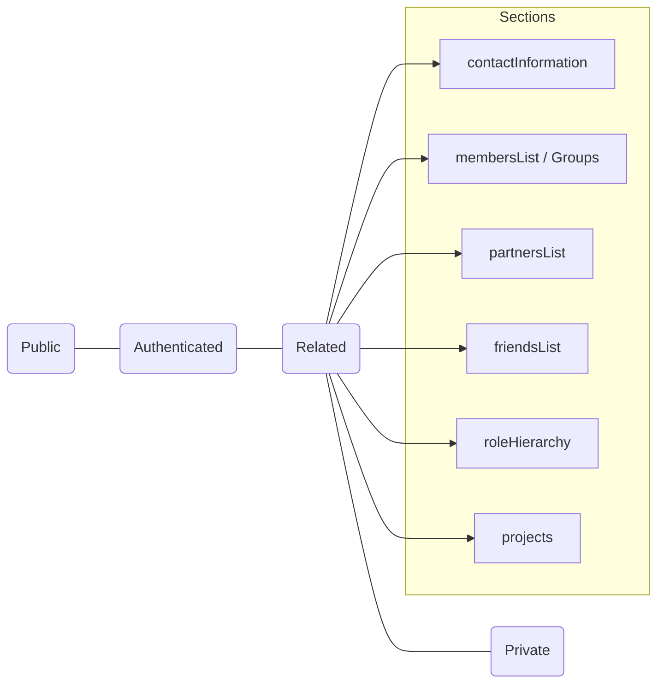

# Privacy Settings: Model, Rules, and UI

This document explains section-level privacy in the ASCEND platform: what audiences exist, how they’re enforced by Firestore Security Rules, how you configure them in the app, and how to migrate existing data.

## Goals

- Provide global and per-section visibility controls on accounts.
- Support audiences that match real relationships: Friends (user↔user), Groups (user↔group), Members/Partners (group relations), Admins, and a unified Related audience (all accepted relations).
- Allow fine-grained exceptions via relationship overrides.

## Data Model

`accounts/{accountId}` includes an optional `privacySettings` object with per‑section configuration.

Audiences (`PrivacyAudience`):

- `public`: anyone
- `authenticated` (labeled "Authorized"): any signed-in user
- `related`: any accepted relationship (friend, member, partner, group)
- `private`: deny-by-default; use allowlist/blocklist or per‑relationship overrides to grant access

Section config (`PrivacySettings`):

- `contactInformation` (migrated to subdoc)
- `membersList` (groups) / “Groups” (users)
- `partnersList` (groups)
- `friendsList` (users)
- `roleHierarchy`
- `projects`
- `messaging` and `discoverability` (aux controls)

Each section is a `SectionPrivacy`:

```
{
  visibility: 'public'|'authenticated'|'related'|'groups'|'friends'|'members'|'partners'|'admins'|'custom',
  allowedRoleIds?: string[],
  allowlist?: string[],  // accountIds explicitly allowed
  blocklist?: string[]   // accountIds explicitly denied
}
```

Per-relationship overrides live on each related account:

```
accounts/{accountId}/relatedAccounts/{relatedAccountId} {
  // legacy
  canAccessContactInfo?: boolean,
  // new
  sectionOverrides?: {
    [sectionKey: string]: { allow: boolean, expiresAt?: Timestamp }
  }
}
```

## Firestore Rules Enforcement

Key helpers resolve the viewer’s relationship and the target section’s audience. Enforcement is applied at the document level:

- Sensitive sections move under subcollection docs so rules can gate them:
  - `accounts/{accountId}/sections/contactInfo`
  - Read allowed if the viewer matches section visibility or has an override.
- Related accounts visibility is filtered per doc:
  - Owners/admins and the subject of the relation always read their doc.
  - Otherwise, read only if the doc’s relationship type matches an allowed audience (e.g., `membersList`, `partnersList`, `friendsList`).
- The base account doc remains readable by existing rules; keep sensitive fields out of it.

Short summary of audience checks:

- `public`: no auth required
- `authenticated`: requires `request.auth`
- `related`: any accepted related account (friend, member, partner, or group)
- `private`: owner/admin or explicit allowlist/override; blocklist denies

## UI Configuration

Settings page provides per‑section visibility and allowlists.

- Users see: Public, Authenticated, Friends, Groups, Related.
- Groups see: Public, Authenticated, Members, Partners, Admins, Custom, Related.
- “Members List” on groups appears as “Groups” on user profiles (both write to `membersList`).
- Contact Info card reads `sections/contactInfo`; if blocked, it shows a “private/unavailable” message.

## Migration and Defaults

- Backfill script initializes sensible defaults and migrates base contact info:
  - Contact Info: related (visible to accepted relations only)
  - Members/Partners/Role Hierarchy/Projects: members
  - Friends (users): friends
  - Web Links: public
  - Messaging: related
  - Discoverability.searchable: true
- Script path: `functions/src/scripts/backfillPrivacy.ts`
- Run from `functions/`:
  - `npm install`
  - `npm run build`
  - `npm run backfill:privacy`

## Examples

- “Only my organizations (no friends) can see my phone number” (user): set Contact Info to `groups`.
- “Only friends can see my friends list” (user): set Friends List to `friends`.
- “Members and partners can see our membership roster” (group): set Members List to `related`.
- “All accepted relationships can see our project list” (user or group): set Projects to `related`.
- “Grant a specific partner temporary access to contact info”: add `sectionOverrides.contactInformation = { allow: true, expiresAt }` to that relation doc.

## Future Enhancements (optional)

- Enforce `allowlist`/`blocklist` in rules: extend `canViewSection` to check account-level allow/block lists in addition to relationship overrides.
- Dual‑write for contact info updates to always write `sections/contactInfo`.

## File Pointers

- Models: `shared/models/account.model.ts`
- Rules: `firestore.rules`
- Contact Info UI: `src/app/modules/account/pages/details/components/contact-information/contact-information.component.*`
- Settings UI: `src/app/modules/account/pages/settings/components/settings/settings.component.*`
- Backfill: `functions/src/scripts/backfillPrivacy.ts`

## Diagrams

### Routes & Containers

```mermaid
graph TD
  A[AppRoutingModule] --> B[AccountModule]
  B -->|/account/settings| S1[SettingsPage]
  B -->|/account/:accountId/settings| S2[SettingsPage (OwnerOrAdminGuard)]
  B -->|/account/:accountId| D1[DetailsPage]

  S1 --> SF[SettingsComponent]
  S2 --> SF

  D1 --> H[Hero]
  D1 --> P[Profile]
  D1 --> CI[ContactInformation]
  D1 --> RC[RelatedAccounts]
  D1 --> PI[ProfessionalInfo]
  D1 --> VAC[VolunteerPreferenceInfo]
  D1 --> MA[MutualAidCommunityInfo]
  D1 --> FAQ[FAQ Section]
  D1 --> RL[RelatedListings]
```

### Settings Update Data Flow



### Viewing Contact Information (Gated Section)



### Rules: Section Access Decision



### Rules: Related Accounts Visibility

```mermaid
flowchart TD
  S[Read accounts/{accountId}/relatedAccounts/{rid}] --> O{Owner/Admin or Subject?}
  O -- Yes --> AL[ALLOW]
  O -- No --> T{Relationship type}
  T -->|member| M{canViewSection('membersList')}
  T -->|partner| P{canViewSection('partnersList')}
  T -->|friend| F{canViewSection('friendsList')}
  M -- true --> AL
  M -- false --> DN[DENY]
  P -- true --> AL
  P -- false --> DN
  F -- true --> AL
  F -- false --> DN
```

### Details Page: Component Tree (Condensed)



### Audiences: Where They Apply


