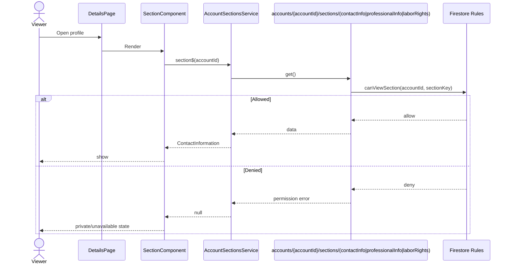
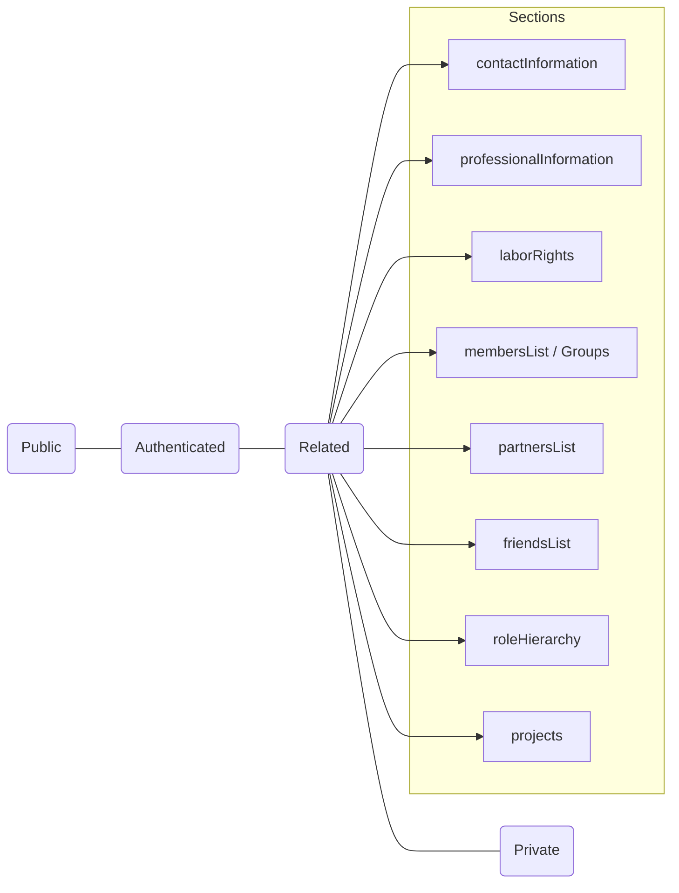

# Privacy Settings: Model, Rules, and UI

This document reflects the privacy features implemented in the app today: audiences, how Firestore rules gate access, and how users configure visibility in Settings.

## Goals

- Provide global and per‑section visibility controls on accounts.
- Cover core audiences that map to real relationships via a single Related audience.
- Allow fine‑grained exceptions using allowlists, blocklists, and per‑relationship overrides.

## Data Model

Accounts may include `privacySettings` with per‑section configuration. The sections currently used are:

- `contactInformation` (gated subdocument)
- `professionalInformation` (gated subdocument)
- `laborRights` (gated subdocument)
- `membersList` (groups) / “Groups” (users)
- `partnersList` (groups)
- `friendsList` (users)
- `roleHierarchy`
- `projects`
- Plus auxiliary controls: `messaging`, `discoverability`

Supported audiences (as implemented in UI and services):

- `public`: anyone
- `authenticated` (labeled “Authorized”): any signed‑in user
- `related`: any accepted relationship (friend, member, partner, or group)
- `private`: deny by default; use allowlist/blocklist or overrides to grant access

Section shape (subset used by the app today):

```
{
  visibility: 'public' | 'authenticated' | 'related' | 'private',
  allowedRoleIds?: string[],
  allowlist?: string[],  // accountIds explicitly allowed
  blocklist?: string[]   // accountIds explicitly denied
}
```

Per‑relationship overrides (optional) live on related account docs and are honored by rules:

```
accounts/{accountId}/relatedAccounts/{relatedAccountId} {
  // Legacy convenience
  canAccessContactInfo?: boolean,
  // New flexible overrides
  sectionOverrides?: {
    [sectionKey: string]: { allow: boolean, expiresAt?: Timestamp }
  }
}
```

Notes

- The Firestore rules also support finer‑grained audiences (e.g., `friends`, `members`, `partners`, `groups`, `admins`) for future UI expansion. The current UI and `PrivacyService` intentionally normalize to the four values above.
- Volunteer Preferences are always treated as public in the UI today and display a “Public” indicator (not configurable yet).

## Firestore Rules Enforcement

Sensitive data is moved to subdocuments that rules can gate, and allow/block lists and overrides are applied consistently.

- Contact Info is stored at `accounts/{accountId}/sections/contactInfo` and read only when the viewer:
  - Is the owner or a group admin, or
  - Is allowed by allowlist, or
  - Is not blocklisted and matches the section `visibility` audience, or
  - Has an explicit per‑relationship override.
- Professional Information is stored at `accounts/{accountId}/sections/professionalInfo`. Reads are gated by `privacySettings.professionalInformation.visibility`. Writes are restricted to the owner.
- Labor Rights is stored at `accounts/{accountId}/sections/laborRights`. Reads are gated by `privacySettings.laborRights.visibility`. Writes are restricted to the owner.
- Related accounts docs are readable to authenticated users; the app filters what is shown per privacy settings.
- Keep sensitive fields out of the base account document.

Audience summary:

- `public`: no auth required
- `authenticated`: requires `request.auth`
- `related`: any accepted related account (friend, member, partner, or group)
- `private`: only owner/admin, allowlist, or an explicit override

## UI Configuration

The Settings page exposes per‑section visibility and allow/block lists using the four audiences above.

- All accounts: Public, Authorized, Related, Private
- “Members List” on groups appears as “Groups” on user profiles (both map to `membersList`).
- Contact Info UI reads from `sections/contactInfo`; if access is denied it displays a private/unavailable state.
- Professional Information and Labor Rights are editable by the owner and mirrored to their gated subdocuments.
- Allowlist/blocklist pickers let you target specific related accounts for each section (Contact Info, Professional Information, Labor Rights, Members/Partners/Friends).
- Details page hides the Professional, Labor Rights, Connections, and Organizations segments if the viewer lacks access (owners/admins always see them).

## Defaults

- If a section’s visibility is missing, the `PrivacyService` defaults to `public` for legacy safety, while the Settings form sanitizes missing values to sensible defaults when saving:
  - Contact Information → `related`
  - Professional Information → `private`
  - Labor Rights → `private`
  - Members/Partners/Friends/Role Hierarchy/Projects → `related`
- When an account already has base‐level contact information, the UI and effects mirror to `sections/contactInfo` for rules‑based access.

## File Pointers

- Models: `shared/models/account.model.ts`
- Rules: `firestore.rules`
- Privacy service (decision logic): `src/app/core/services/privacy.service.ts`
- Contact Info UI: `src/app/modules/account/pages/details/components/contact-information/contact-information.component.*`
- Professional Info UI: `src/app/modules/account/pages/details/components/professional-info/*`
- Labor Rights UI: `src/app/modules/account/pages/details/components/labor-rights-info/*`
- Settings UI: `src/app/modules/account/pages/settings/components/settings/settings.component.*`
- Gated section reads: `src/app/modules/account/services/account-sections.service.ts`

## Diagrams

### Routes & Containers

```mermaid
graph TD
  A[AppRoutingModule] --> B[AccountModule]
  B -->|/account/:accountId/settings| S1[SettingsPage (OwnerOrAdminGuard)]
  B -->|/account/:accountId| D1[DetailsPage]

  S1 --> SF[SettingsComponent]
  S2 --> SF

  D1 --> H[Hero]
  D1 --> P[Profile]
  D1 --> CI[ContactInformation]
  D1 --> RC[RelatedAccounts]
  D1 --> PI[ProfessionalInfo]
  D1 --> LR[LaborRights]
  D1 --> VAC[VolunteerPreferenceInfo]
  D1 --> MA[MutualAidCommunityInfo]
  D1 --> FAQ[FAQ Section]
  D1 --> RL[RelatedListings]
```

### Settings Update Data Flow


### Viewing Gated Sections (Contact/Professional/Labor)



### Rules: Section Access Decision


### Rules: Related Accounts Visibility

```mermaid
flowchart TD
  S[Read accounts/{accountId}/relatedAccounts/{rid}] --> O{Owner/Admin or Subject?}
  O -- Yes --> AL[ALLOW]
  O -- No --> T{Relationship type}
  T -->|member| M{canViewSection('membersList')}
  T -->|partner| P{canViewSection('partnersList')}
  T -->|friend| F{canViewSection('friendsList')}
  M -- true --> AL
  M -- false --> DN[DENY]
  P -- true --> AL
  P -- false --> DN
  F -- true --> AL
  F -- false --> DN
```

### Details Page: Component Tree (Condensed)


### Audiences: Where They Apply


